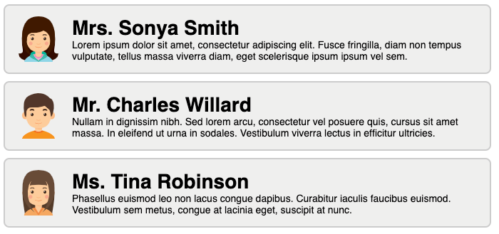

## Zadanie 1 - rozwiązywane z wykładowcą

W pliku `js/data/people.js` znajduje się tablica z obiektami reprezentującymi osobę. Zaimportuj ją do pliku za pomocą:

```js
import people from "./data/people";
```

Używając metody `map()` stwórz z tablicy elementy `div` zawierające imię i nazwisko danej osoby. Nazwy tych właściwości obiektu znajdziesz w importowanym pliku.

Następnie za pomocą React wyrenderuj w elemencie o id `app` wszystkie wygenerowane elementy `div`.

**Pamiętaj o użyciu odpowiedniego klucza!**


## Zadanie 2

W pliku `js/data/person.js` znajduje się obiekt reprezentujący osobę. Zaimportuj go do pliku `js/app.js` za pomocą:

```js
import person from "./data/person";
```

Celem tego zadania jest wyświetlenie na stronie wszystkich informacji zawartych w tym obiekcie. Struktura tego elementu powinna wyglądać następująco:

```HTML
<h1>{ tytuł + imię + nazwisko }</h1>
<span>{ wiek }</span>
```

Bezpośrednim rodzicem elementów `h1` i `span` ma być element o id `app`. Należy tutaj skorzystać z `React.Fragment`.


## Zadanie 3

W pliku `js/data/people.js` znajduje się tablica z obiektami reprezentującymi różne osoby. Zaimportuj ją do pliku za pomocą:

```js
import people from "./data/people";
```

Zadaniem jest przeiterowanie po całej tablicy obiektów, tak aby stworzyć tablicę z gotowymi elementami `JSX`. Każdy element tej nowo utworzonej tablicy powinien mieć strukturę zbliżoną do następującej:

```html
<div class="person">
    
    <div class="info">
        <h1>{ tytuł + imię + nazwisko }</h1>
        <p>{ bio }</p>
    </div>
</div>
```

Powyższy kod jest jedynie poglądowy. Pamiętaj, w jaki sposób powinna być przekazywana nazwa klasy `CSS` w tagach `JSX` oraz o odpowiednich zamknięciach znaczników. Nazwy tych właściwości obiektu znajdziesz w importowanym pliku.

Efektem powinny być elementy podobne do tego:



Następnie za pomocą React wyrenderuj w elemencie o id `app` element `<>`, w którym będą się wyświetlały wszystkie wygenerowane elementy `div`.

**Pamiętaj o użyciu odpowiedniego klucza!**

