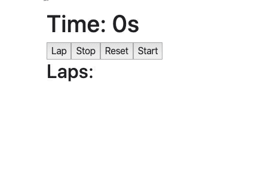

## Zadanie 1 - rozwiązywane z wykładowcą

Stwórz komponent `Box` który będzie przetrzymywał w stanie swój kolor (domyślnie `cornflowerblue`). Renderować ma `diva` o wymiarach `100x100px` i kolorze podanym w stanie.

Po 2 sekundach kolor ma się zmienić na `tomato`.

## Zadanie 2 - rozwiązywane z wykładowcą

Komponent `CustomTitle` ma zawierać informacje o ilości kliknięć (początkowo 1) w element `p` na stronie. Element ten ma wyświetlać napis: "Kliknięto mnie już: {n} razy". 

Ma on również zwiększać swój `font-size` razem z liczbą kliknięć według wzoru: `n * 1.2rem`.

Dodatkowo, ilość kliknięć ma się wyświetlać w tytule strony (obiekt `document`). Wykorzystaj do tego `useEffect`.

## Zadanie 3

Stwórz komponent `UserInfo` który ma posiadać w swoim stanie obiekt składający się z imienia i nazwiska.

**Po zamontowaniu komponentu** należy zmienić to imię i nazwisko na dowolne inne.

Pamiętaj o tym, aby zrobić to w odpowiednim miejscu, tak by nie doszło do nieskończonego renderowania komponentu.

Wyświetl to imię i nazwisko ze stanu komponentu w elemencie `p`.

## Zadanie 4

Jest to powtórzenie zadania z dnia wczorajszego. Teraz zróbcie je używając tylko komponentów funkcyjnych.

Stwórz komponent `Clock`, który przechowuje w `state` aktualną datę.

Dodaj do swojego komponentu `interval`, który co 1 sekundę aktualizuje datę w state na aktualną. Pamiętaj aby zrobić to w odpowiedniej metodzie oraz aby zwolnić zasoby.

Stwórz dwa subkomponenty:

1. `ClockTime` - przyjmuje przez props datę (`date`) i wyświetla samą godzinę w elemencie h1 za pomocą `Date.toLocaleTimeString()`.

2. `ClockDate` - przyjmuje przez props datę (`date`) i wyświetla samą datę w elemencie h1 za pomocą `Date.toLocaleDateString()`.

Główny komponent - `Clock` renderuje odpowiednio dwa subkomponenty przekazując im aktualną datę ze swojego state.

Pamiętaj aby zbudować także główny komponent `App`, a w nim wykorzystywać komponenty budowane w ćwiczeniach. Renderuj na stronie główny komponent `App`.

## Zadanie 5

Stwórz komponent `Stopwatch`. Jego zadaniem będzie odmierzanie czasu. Komponent powinien w swoim stanie przetrzymywać:

- czas stopera (`time`)
- listę okrążeń (`laps`)
- czy interwał jest aktywny (`isRunning`)

Ma on renderować:

- `h1` z napisem "Time: {time}s"
- 4 przyciski
  - "Lap"
  - "Stop"
  - "Restart"
  - "Start"
- listę `ul` z wyświetloną tablicą `laps`

Zaraz po uruchomieniu komponentu, stoper powinien zacząć odliczać sekundy w górę. Po kliknięciu przycisku "Stop" stoper ma się zatrzymać. Po wciśnięciu "Start" rozpocząć dalsze odliczanie od miejsca, w którym został zatrzymany.

Kiedy stoper jest aktywny, przycisk "Lap" ma dodawać aktualny czas do tablicy `laps`.

"Restart" ma kończyć działanie stopera i resetować interwał, czas i tablicę okrążeń.

Przykład:

