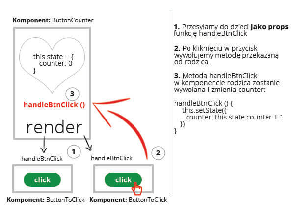

## Zadanie 1 - rozwiązywane z wykładowcą

Stwórz komponent `ButtonCounter` oraz komponent `ButtonToClick`.

Komponent `ButtonCounter` wyświetla `div`, a w nim `h1` oraz 2 przyciski stworzone za pomocą komponentu `ButtonToClick`. W `h1` ma być na początku wyświetlane 0 - docelowo ma tam się wyświetlać ile razy (łącznie) zostały kliknięte przyciski.

Komponent `ButtonToClick` zawiera  przycisk `button`, po kliknięciu którego jest przesyłana odpowiednia informacja do callbacku, który pobiera z props atrybut pod nazwą `onClick`. **Nie zapomnij sprawdzić czy ten atrybut został odpowiednio przekazany i jest funkcją.**

Na schemacie poniżej zostało zobrazowane, jak mniej więcej powinien wyglądać proces przekazywania funkcji i gdzie ona jest wywoływana. To tylko rysunek poglądowy, pomagający zrozumieć cały proces.




## Zadanie 2

Stwórz komponent `Shop` oraz komponent `ShopItem`.

`ShopItem` zawiera `div`, a w nim `h1`, którego zawartość jest pobierana z props `title`. W `div` znajduje się też przycisk z napisem "Kup". Po jego kliknięciu przesyła się odpowiednią informację do callbacku, który pobiera ją z props pod nazwą `onBuy`. Nie zapomnij sprawdzić czy ten atrybut został odpowiednio przekazany i czy jest funkcją. Wywołanie callbacku ma się odbyć za argumentem pobieranym z tytułu przekazanego w props (`title`).

Shop ma mieć następującą strukturę:

```html
<div>
  <ShopItem title="MacBook Pro" />
  <ShopItem title="Dell X5500" />
  <ShopItem title="Asus NT6000" />
  <ul>
    {list}
  </ul>           
</div>        
```
Zamiast `list` ma się pojawić lista elementów `li` z wymienionymi elementami, na których użytkownik kliknął przycisk "Kup".
